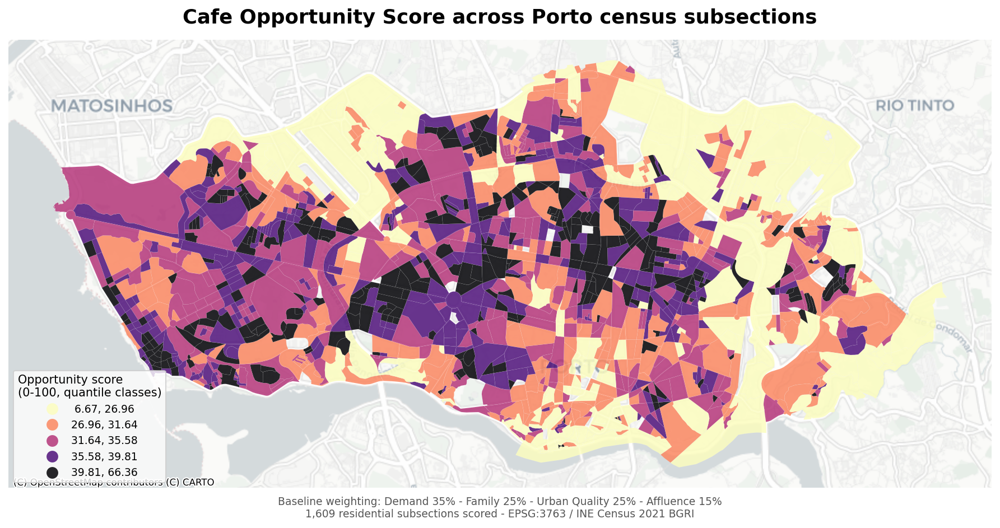
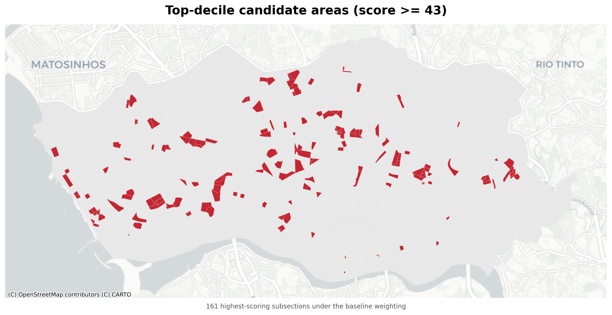

# Where should a family café open in Porto?

**A location-intelligence model that scores all 1,659 Porto census subsections by how well they fit one specific café concept — and recommends where to start looking.**

This is a portfolio case study in geospatial analysis, statistical reasoning, and turning a fuzzy business brief into a defensible, reproducible model. It does **not** predict revenue; it builds a transparent **location-suitability score** and is honest about what it can and cannot yet tell you.



> 🗺️ **[Explore the interactive map →](https://joanabutton.github.io/location_intelligence/)** — pan, zoom, and switch between the baseline, family-focused, and premium-focused weightings.

---

## The question

> *If I had €150,000 and wanted to open an independent, family-oriented neighbourhood café in Porto tomorrow, where should I start looking?*

The concept is specific: specialty coffee, homemade pastries, a children's corner, a calm atmosphere, and a **regular local clientele** — not tourists. The target customer is a resident with moderate-to-high purchasing power: parents, freelancers, and culture-oriented locals who value familiarity and quality over speed or cost. Every variable in the model has to earn its place against *that* concept, not a generic "nice neighbourhood" ideal (see [`Documents/02_concept_to_variables.md`](Documents/02_concept_to_variables.md)).

## The answer (first iteration)

The model scores **1,609 residential subsections** from 0–100 (median 34, best 66). The top-decile candidates spread across all seven of Porto's parishes — the [**interactive map**](https://joanabutton.github.io/location_intelligence/) pins the top 15 so you can click each one for its parish, score, and index breakdown:



Reading the scores through their sub-indices, two areas stand out as the strongest starting points — each winning on a *different* half of what this concept needs:

| Candidate area | Why it scores | Best-fit positioning |
|---|---|---|
| **Aldoar** *(west, beside Parque da Cidade)* | Highest single score in the city (66/100) — strong residential demand and direct access to Porto's largest urban park; affluence only moderate | Leans on the *family / lingering* strength of the concept |
| **Cedofeita** *(central Porto, historic-centre parish)* | The densest cluster of high–purchasing-power subsections in the top tier | The clearer *"moderate premium"* candidate |

A high-affluence outlier worth noting sits in the **historic Ribeira riverfront** (same parish as Cedofeita) — but it's a single standout subsection, not a district. And **Campanhã** in the east contributes several high scores on demand and public-realm access, yet its near-zero affluence makes it the *riskiest* fit for a premium price point — a good reminder that the raw score must be read through the sub-indices, not taken flat. Full breakdown and per-subsection table in [`Notebooks/04_opportunity_score_and_recommendation.ipynb`](Notebooks/04_opportunity_score_and_recommendation.ipynb).

*(Parish names were verified by reverse-geocoding each subsection's centroid against OpenStreetMap; a full join to official CAOP boundary polygons is the rigorous next step — see limitations below.)*

## How the model works

Seven census- and OpenStreetMap-derived indicators, each computed per subsection, standardised (min-max, 0–1) and combined into **four thematic indices**, then into a single weighted score:

```
Opportunity score =  0.35 × Demand        (population density)
                   +  0.25 × Family        (child density, family households, private-school access)
                   +  0.25 × Urban Quality (walking distance to nearest large-park entrance)
                   +  0.15 × Affluence      (university-degree %, foreign-national %)
```

The weights are an explicit expert-judgement design decision, documented and defended rather than hidden — demand is the foundation (no residents, no regulars), family and lingering-quality define this concept against a generic café, and affluence is a viability floor rather than the driver.

**Sensitivity analysis** tests how much that judgement matters. Re-running with a *family-focused* weighting barely moves the ranking (Spearman 0.97) — the baseline already leans that way. A *premium-focused* weighting moves it much more (Spearman 0.79; only 43% of the top decile survives), which is itself the finding: **the recommendation isn't just a proxy for "rich neighbourhoods"** — most of it rests on demand, family fit, and public-realm quality.

One methodological highlight worth opening the notebooks for: the Urban Quality input is a **network walking-distance to park entrances** (routed over Porto's real pedestrian network, with manually ground-truthed entrance points), not a naïve straight-line buffer around park polygons — because a buffer credits access across rivers, walls, and uncrossable roads. See [`Notebooks/03`](Notebooks/03_explore_public_realm_lingering_potential.ipynb).

## Explore the results yourself

Two ways to dig in, depending on how deep you want to go:

- **In the browser — [interactive map](https://joanabutton.github.io/location_intelligence/).** Pan and zoom, toggle the baseline / family-focused / premium-focused weightings, and click the pinned top-15 candidate areas for their parish, score, and index breakdown. No install.
- **In QGIS — the full analytical layer.** The project ships a QGIS project ([`QGIS/location_intelligence.qgz`](QGIS/location_intelligence.qgz)) already pointed at [`Data/Processed/bgri_master.gpkg`](Data/Processed/bgri_master.gpkg). Open it to explore every subsection and every variable directly — style the `opportunity_score` or any sub-index as a choropleth, filter with expressions (e.g. `affluence_index > 0.5 AND demand_index > 0.5`), inspect the attribute table, and overlay your own layers. This is the best surface for *your own* exploration: change classifications, query candidate areas, and sanity-check the model against local knowledge. The GeoPackage is EPSG:3763 and keyed on `BGRI2021`; the field-by-field meaning of every column is in [`Documents/05_data_dictionary.md`](Documents/05_data_dictionary.md).

## What this first iteration deliberately does *not* do

Shipping a complete, honest thin model was chosen over a broad half-finished one. Known limitations, stated plainly:

- **No competition or tourism data yet** — so the external-validity check ("do successful cafés already cluster in high-scoring areas?") was **not** performed rather than faked. This is the single most valuable next step.
- **Urban Quality rests on one input** (park access) until walkability, transit, and cultural-amenity data are added.
- **Affluence uses proxies** (education, foreign-national share) with no direct property-value or income data; the foreign-national proxy is explicitly flagged as ambiguous (cosmopolitan vs. tourism-adjacent).
- **Parish names come from centroid reverse-geocoding**, not a full boundary-polygon join to official CAOP administrative units — good enough to name areas, not yet a definitive assignment.

Each is a scoped v2 task, not a vague gap — see the roadmap for the full sequence.

---

## Reproducibility & architecture

Built entirely in Jupyter notebooks (no application code). Notebooks run in numeric order; each analytical phase reads source data, derives its own indicators, and accumulates them into a single canonical layer:

- **`Data/Processed/bgri_master.gpkg`** — one row per BGRI subsection, the only data file tracked in git; everything else is reproducible from public sources.
- Each notebook **owns** a declared set of columns and refreshes only those on re-run (drop-then-merge on the `BGRI2021` key), so any one phase can be re-run without rebuilding the whole pipeline or touching another notebook's outputs.

| Phase | Topic | Status | Notebook |
|-------|-------|--------|----------|
| 1 | Residential demand — population, child, family density | ✅ Complete | [`01`](Notebooks/01_explore_residential_demand.ipynb) |
| 2 | Lifestyle & purchasing power — education, nationality, private schools | ✅ Complete *(property values → v2)* | [`02`](Notebooks/02_explore_lifestyle_purchasing_power.ipynb) |
| 3 | Public realm — park-entrance network access (§3.2) | 🟡 Partial *(§3.1/3.3/3.4 → v2)* | [`03`](Notebooks/03_explore_public_realm_lingering_potential.ipynb) |
| 4 | Competition & risk — cafés, tourism | ⬜ Deferred to v2 | — |
| 5–8 | **Synthesis** — distributions, correlation, standardisation, indices, weighted score, sensitivity, maps, recommendation | ✅ Complete (MVP) | [`04`](Notebooks/04_opportunity_score_and_recommendation.ipynb) |

### Environment

Conda environment `urban-intelligence-lab`. Core stack: `geopandas`, `pandas`, `numpy`, `scipy`, `scikit-learn`, `matplotlib`, `seaborn`, `contextily`, `mapclassify`, `folium`, `osmnx`, `jupyter`.

```bash
conda activate urban-intelligence-lab
cd Notebooks
jupyter lab
```

To reproduce from scratch: download the raw data (sources below) into `Data/Raw/` and run the notebooks in order.

### Data sources

Raw inputs are gitignored (reproducible from public sources); only the enriched `bgri_master.gpkg` is tracked.

| Dataset | Source |
|---------|--------|
| BGRI 2021 census boundaries + demographics, Porto (code 1312) | [INE](https://www.ine.pt) — Census 2021 |
| Census 2021 results, section & subsection level (education, nationality) | [INE](https://www.ine.pt) — Census 2021 |
| School network (Rede Escolar) | Ministério da Educação / Porto Open Data |
| Parks, gardens, playgrounds, pedestrian network | [OpenStreetMap](https://www.openstreetmap.org) via OSMnx |

The spatial unit throughout is the **BGRI subsection** (*subsecção estatística*) — Portugal's smallest census geography, roughly one urban block; Porto has 1,659. All analysis uses **EPSG:3763** (ETRS89 / Portugal TM06), reprojecting to Web Mercator only for interactive rendering.

### Project documents

| File | Purpose |
|------|---------|
| [`01_project_brief.md`](Documents/01_project_brief.md) | Concept, target customer, objective, success criteria |
| [`02_concept_to_variables.md`](Documents/02_concept_to_variables.md) | Qualitative requirements → measurable indicators |
| [`04_roadmap.md`](Documents/04_roadmap.md) | Phase-by-phase plan, and what was deferred and why |
| [`05_data_dictionary.md`](Documents/05_data_dictionary.md) | Every field, its source, and its derivation formula |
| [`06_glossary.md`](Documents/06_glossary.md) | GIS & analytical terminology |

### Other outputs

Interactive Folium maps (`Maps/*.html`), a QGIS project ([`QGIS/location_intelligence.qgz`](QGIS/location_intelligence.qgz)) pointed at the master layer, and per-phase GeoPackages under `Data/Processed/`.
